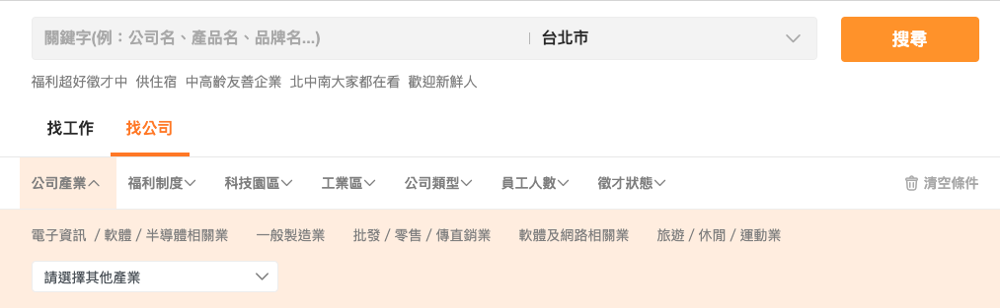
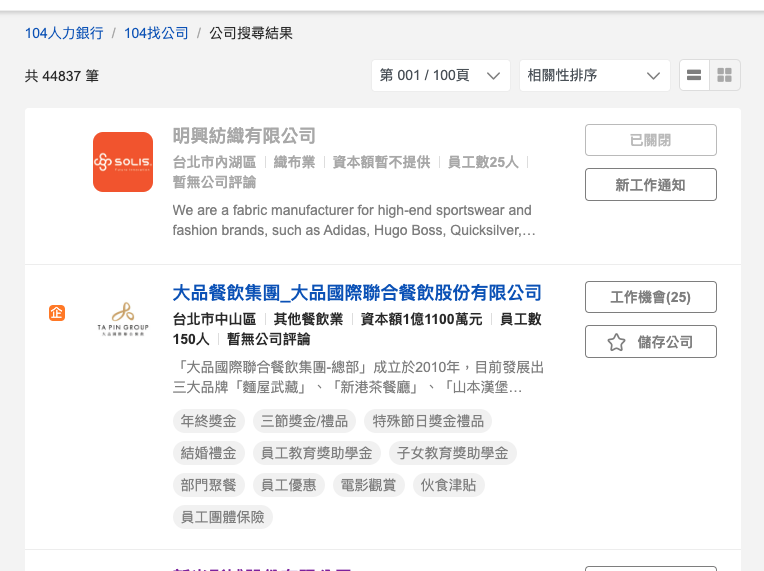
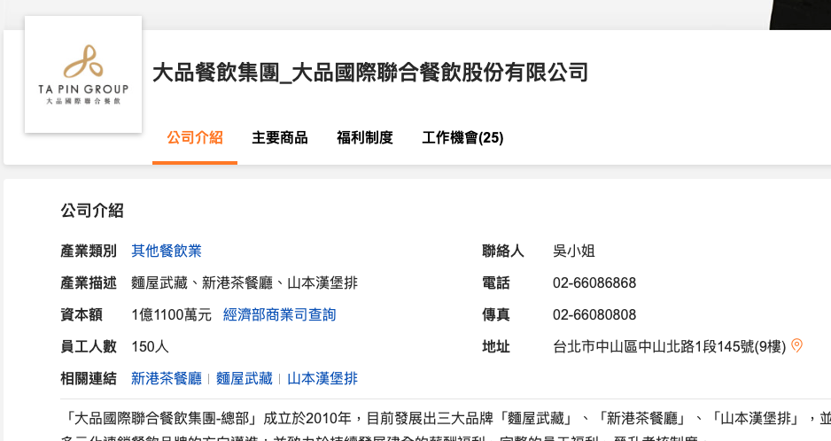

# 104 公司爬蟲 Crawler used to search for companies

- [104 公司爬蟲 Crawler used to search for companies](#104-公司爬蟲-crawler-used-to-search-for-companies)
  - [專案介紹](#專案介紹)
  - [環境安裝](#環境安裝)
  - [搜尋條件](#搜尋條件)
  - [搜尋機制](#搜尋機制)

## 專案介紹

本專案設計針對 104 公司 (工作) 的爬蟲，依據搜尋需求，進行公司的 `公司名稱`、`公司產業`、`資本額`、`員工人數`、`聯絡人`、`聯絡電話`、`地址` 進行資料查找，輸出於 Excel 檔。

當然，在使用網頁爬蟲時，我們需要遵守網站的使用條款及隱私政策，不可以違反網站的規定進行資訊抓取。同時，為了保障網站的正常運作，我們也需要設計適當的爬取策略，避免對網站造成過大的負荷。

## 環境安裝

本範例使用 Python3 並且會使用 pip 來安裝所需的套件。以下是需要安裝的套件：

- `requests`：用於發送與接收 HTTP 請求及回應。
- `openpyxl`：用於處理 Excel 相關的操作。

使用以下指令來安裝這些套件：

```bash
pip install requests openpyxl
```

## 搜尋條件

針對搜尋內容可傳入條件進行查找，相關條件可見 104 網站上：



針對所有搜尋條件的 key value 整理後置於 `src/filter_params.md` 內，可於呼叫 `search_companies` 函式時，加入搜尋條件於 `filter_params` 參數內：

```python

# 搜尋條件
filter_params = {
  'area': '6001001002',  # (地區) 台北市大同區
  'jobsource': 'cs_custlist', # 資料來源 - 104 自帶
  'mode': 's', # 模式 - 104 自帶
  'pageSize': '18', # 單頁資料筆數 - 104 自帶
}

companies = search_companies(max_page=100, filter_params=filter_params)
```

## 搜尋機制

目前在 104 的 **找公司** 進行搜尋，可得出搜尋條件下公司的 `總筆數`、`總頁數(上限100頁)`、`每頁18筆資料` 列表頁：



由於上面的列表頁只提供基本資訊，細節還需點擊各個公司才會呈現單筆公司頁：



因此透過取得列表頁後，帶入每筆公司的唯一識別值，發送請求至單筆公司 API 取得單筆公司資料，資料回傳後取得相對應 key value，寫入至 Excel。

```json
{
  "custSwitch": "on",
  "custName": "大品餐飲集團_大品國際聯合餐飲股份有限公司",
  "custNo": 53082536000,
  "industryDesc": "其他餐飲業",
  "industryNo": "1016002003",
  "indcat": "麵屋武藏、新港茶餐廳、山本漢堡排",
  "empNo": "150人",
  "capital": "1億1100萬元",
  "address": "台北市中山區中山北路1段145號(9樓)",
  "industryArea": null,
  "custLink": "",
  "profile": "「大品國際聯合餐飲集團-總部」成立於2010年，目前發展出三大品牌「麵屋武藏」、「新港茶餐廳」、「山本漢堡排」，並持續朝多元化連鎖餐飲品牌的方向邁進；並致力於持續發展建全的薪酬褔利、完整的員工福利、晉升考核制度。",
  "product": "※品牌一：『麵屋武藏』~東京熱銷品牌拉麵\n以強烈的古代武士風格，師法日本第一劍聖：宮本武藏自創二刀流心法，開創出拉麵界第一碗W Soup(雙湯頭)。1996年成立以來，不斷挑戰傳統日式拉麵思維，開發季節性限定菜色、使用爵士樂於店內播放，率先採用秋刀魚干提煉拉麵湯底，引起同業爭相仿效。\n『麵屋武藏』於發源地東京的12家名店，各自保有獨特的個性與風格，並在2013年7月正式登台，滿足台灣民眾對道地日式拉麵的期待！\n●營業據點：\n1.本店：【台北捷運-北車站  】台北市中正區忠孝西路一段36號B1-2櫃\n2.神山：【台北捷運-中山站  】台北市中山區中山北路一段121巷18號\n3.武骨：【左營環球購物中心】高雄市左營區站前北路1號3樓 \n4.台中：【台中JMall廣場  　】台中市西屯區台灣大道四段1038號2樓\n5.光復：【台北捷運-國父紀念館站】台北市大安區光復南路240巷23號\n\n※品牌二：『新港茶餐廳』~融合傳統與創新的港式料理\n2012年創立於新舊文化交融的西門町商圈，堅持用料新鮮、手法精緻、環境舒適、價格實惠，開幕至今已迅速獲得各界的好評，媒體亦爭相報導。\n『新港茶餐廳』秉持對美食與服務的要求，提供創意港點、港式料理、精緻茶點、創意飲料甜品，符合都會人士及潮男潮女對品質及時尚的需求。\n●營業據點：\n1.西門：【台北捷運西門站】台北市萬華區漢中街52號7樓-台北西門町商圈\n\n※品牌三：『山本漢堡排』~日本東京排隊名店\n2015年8月引進至台灣東區的『山本漢堡排』\n在日本，漢堡排是家喻戶曉的國民美食，幾乎每個日本家庭都會做，堪稱最具日本親子文化的溫馨料理。\n山本漢堡排2005年於惠比壽創立本店，2008年開設第二家；目前在東京已擁有6家分店，是相當知名的排隊名店之一。\n強調新鮮與健康，提出4大特色：\n1.嚴選肉品：採用頂級美澳牛肉與台灣豬肉。\n2.好吃的米：進口日本優質米，注重品質與恆溫保存，提供口感絕佳的米飯。\n3.新鮮蔬菜：使用當季時令蔬菜，店內同時提供現打新鮮蔬果汁。\n4.重視員工：深信員工的熱情、笑容和美味的山本漢堡排，是讓顧客用餐愉快的關鍵。\n台灣的山本漢堡排承襲此4大特色，積極尋找充滿熱情、樂於分享、喜愛與人接觸的優秀人才，加入我們的行列，一起透過美味的漢堡排，傳遞喜悅與幸福給每位上門的顧客！\n●營業據點：\n1.光復：【台北捷運國父紀念館站】台北市大安區光復南路260巷1號",
  "welfare": "①福委會(正兼職適用，每年度重新發佈)\n●生日禮券、三節/五一獎金、禮券\n●結婚補貼、喪葬補貼\n●暑期電影票、餐券\n●教育獎助學金\n●團體保險\n②獎金\n●業績、活動達成獎金、推薦獎金\n●年終獎金、留任獎金、支援津貼(正職適用)\n●滿時津貼(兼職適用，每月重計)\n③升遷/訓練\n●完整教育訓練\n●年度考核，通過即可加薪\n●依職等培訓組長、副店、店長之執行管理經營能力\n④用餐福利\n●全品牌消費員工八折(本人親臨，不限人數，整單八折)\n●全品牌消費親友九折(本人未到，親友用餐，不限人數，整單九折)\n●員工餐(依照各品牌門市規定)\n⑤請休假福利(給薪假)\n●特休/年假/婚假/喪假\n●(安胎)產假/產檢假/陪產假\n●病假/生理假/公傷假\n⑥保險保障\n●勞保、健保\n●勞工退休、全額職災補償",
  "management": "真實的食材、熱情的款待、多元的餐點，是我們的核心價值~\n我們用心服務外部顧客，讓公司持續的成長茁壯~\n我們真心關懷內部員工，讓伙伴們與公司共同成長~\n我們深信透過『用心服務、真心關懷』的經營理念，是連結『顧客、員工、公司』的方式\n為此，每年總部不斷透過稽核、訓練、考核、晉升、訪談的執行，以致力達到此經營理念。\n\n歡迎對餐飲業有熱情有想法，想一展長才的夥伴一起加入，期望共同創造顧客感動及員工幸福！",
  "phone": "02-66086868",
  "fax": "02-66080808",
  "hrName": "吳小姐",
  "lat": "25.051979",
  "lon": "121.522851",
  "logo": "//static.104.com.tw/b_profile/cust_picture/6000/53082536000/logo.jpg?v=20220415103340",
  "news": "",
  "newsLink": "",
  "zone": {},
  "linkMore": {
    "新港茶餐廳": "http://www.newhongkong.com.tw",
    "麵屋武藏": "https://www.facebook.com/menya634taiwan/",
    "山本漢堡排": "https://www.facebook.com/orehan.taiwan/"
  },
  "corpImage2": "//static.104.com.tw/b_profile/cust_picture/6000/53082536000/custintroduce/image2.jpg?v=20220415103340",
  "corpImage1": "//static.104.com.tw/b_profile/cust_picture/6000/53082536000/custintroduce/image1.jpg?v=20220415103340",
  "corpImage3": "//static.104.com.tw/b_profile/cust_picture/6000/53082536000/custintroduce/image3.jpg?v=20220415103340",
  "corpLink2": "",
  "corpLink1": "https://www.facebook.com/orehan.taiwan/",
  "corpLink3": "https://www.facebook.com/newhongkongtw",

  ... 中略

  "isSaved": false,
  "isTracked": false,
  "addrNoDesc": "台北市中山區",
  "reportUrl": "//www.104.com.tw/feedback?custName=%E5%A4%A7%E5%93%81%E9%A4%90%E9%A3%B2%E9%9B%86%E5%9C%98_%E5%A4%A7%E5%93%81%E5%9C%8B%E9%9A%9B%E8%81%AF%E5%90%88%E9%A4%90%E9%A3%B2%E8%82%A1%E4%BB%BD%E6%9C%89%E9%99%90%E5%85%AC%E5%8F%B8&category=2",
  "postalCode": 104
}
```
